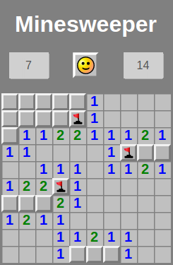

# Minesweeper

## Description
Remember the classic Minesweeper game? This application is an attempt to write Minesweeper in a clean JavaScript code.
It is a simple WEB application, without server parts. It includes all the basic functions and implements the original
graphics.

The application was created as a task at [CodeCool](https://codecool.com/en/) school. A description of the task
as well as additional information can be found here: [Exercise](https://github.com/piotrmludzik/minesweeper/wiki/Exercise).
Learning programming while writing your favorite game is a great pleasure!

## Screenshots

## Real-time preview
[https://minesweeper-pm.herokuapp.com/](https://minesweeper-pm.herokuapp.com/)

## Used technologies:

## Challenges:
- learning JavaScript and handling user interactions with JavaScript event handlers,
- finding DOM elements by their properties,
- changing the found DOM elements' style,
- measure and show time with built-in JavaScript functions.

## Future plans:
- implementation of custom graphic,
- implementation light / dark mode,
- creating movement history,
- creating some statistics.

## Contact info
Feel free to contact me in case of any issue, questions or comments.
My contact info can be found on my [GitHub page](https://github.com/piotrmludzik).

## License
The content of the exercise and the initial code in the repository are owned by [CodeCool](https://codecool.com/en/).

Copyright (c) 2020 by Piotr Mludzik. All rights reserved. Copyrights apply only to the code itself,
not to the game idea, graphics, or any other rights that the game owner owns.

Code in this repository is licensed under MIT license. See [LICENSE](https://github.com/piotrmludzik/minesweeper/blob/master/LICENSE).

